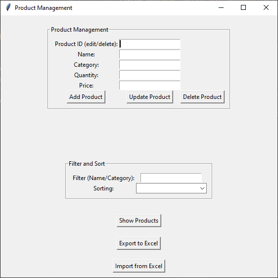
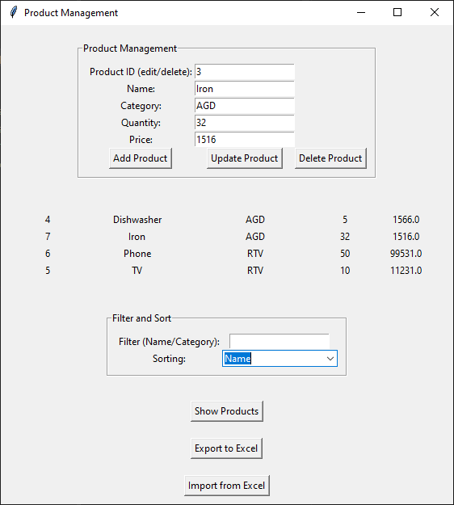
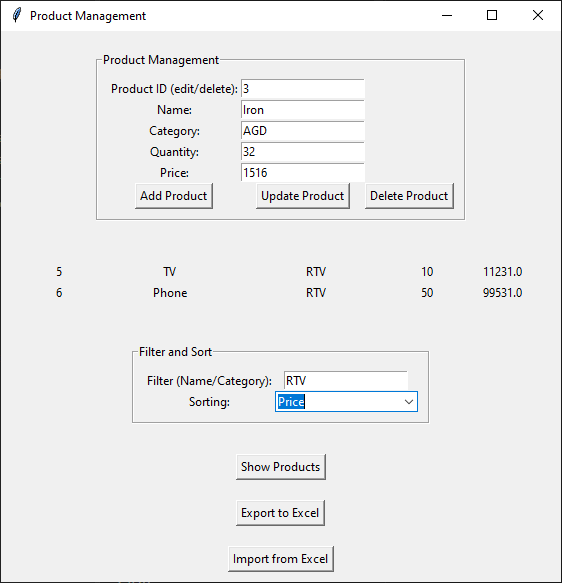
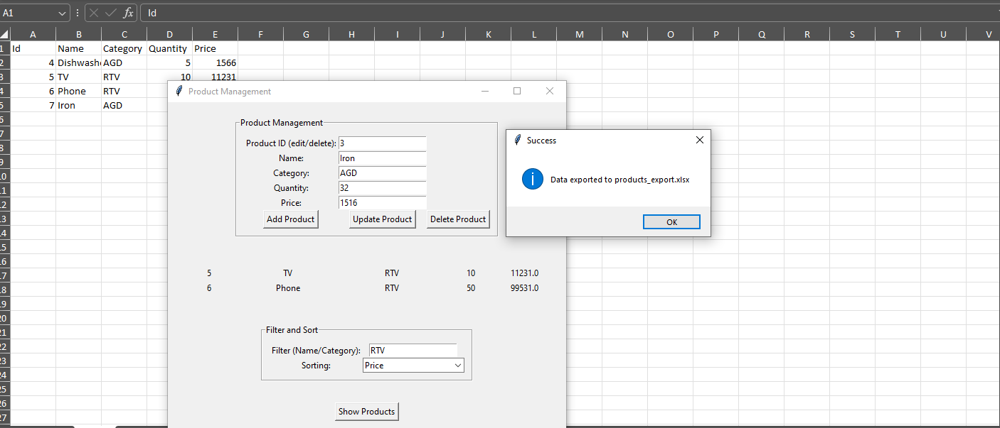
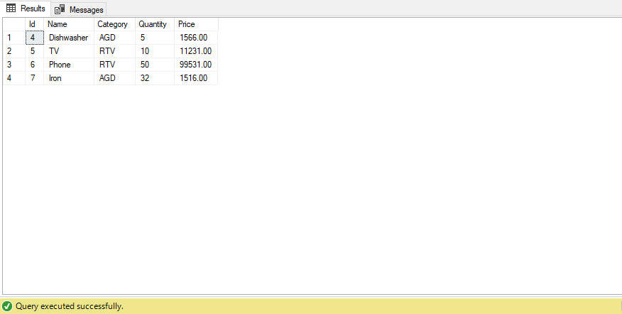

# Python SQL Inventory Manager

Inventory management application built with **Python**, **Tkinter** and **Microsoft SQL Server**.

The application provides a graphical interface for managing products stored in a SQL Server database. It supports full CRUD operations, filtering, sorting, validation and Excel import/export.

## Features

* Add new products
* Update existing products
* Delete products
* Browse inventory records
* Filter products by name or category
* Sort products by different columns
* Input validation
* Automatic SQL table creation
* Export inventory to Excel
* Import inventory from Excel
* Microsoft SQL Server integration
* Simple Tkinter desktop GUI

## Technologies

* Python 3
* Tkinter
* pyodbc
* Microsoft SQL Server
* pandas
* Excel (.xlsx)

## Database

The application automatically creates the `Products` table if it does not already exist.

Example fields:

* Id
* Name
* Category
* Quantity
* Price

## Screenshots

### Product Management



### Product List



### Filtering and Sorting



### Excel Export



### SQL Server Database



## Requirements

```bash
pip install pyodbc pandas openpyxl
```

Microsoft SQL Server and ODBC Driver 17 (or newer) must be installed.

Update the following variables before running:

```python
SERVER = "localhost\\SQLEXPRESS"
DATABASE = "HOMELAB_CorpHR"
```

## Run

```bash
python tkinter-crud-sql-server-app.py
```

## Future Improvements

* Search by multiple fields
* Product images
* User authentication
* Inventory statistics dashboard
* PDF reporting
* Barcode support

## License

MIT License
